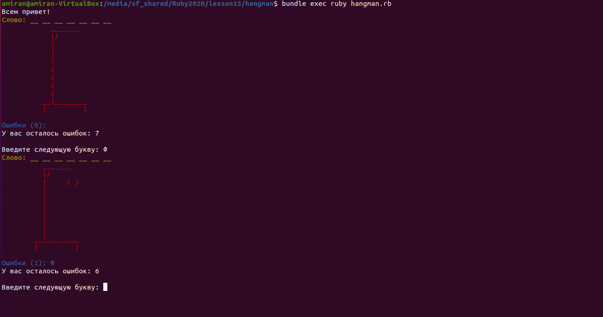

# Игра "Виселица"  
Привет! Это знаменитая игра ["Виселица"](https://cutt.ly/noWn37W), написанная на языке Ruby(v.2.7.1p83).

## Суть игры 
Есть загаданное слово, которое игрок должен отгадать. На это даётся 7 попыток.
Каждая ошибка это шаг к виселице. Количество ошибок, ваш статус "висельника" и слово, которое надо отгадать,
находятся у вас на экране.

### Как добавить новые слова 
Чтобы добавить новые слова в игру, пройдите в `/data/words.txt` и запишите туда нужные слова.

### Как запустить игру у себя на компьютере
Для запуска программы вам нужно предпринять следующие шаги:

```
git clone git@github.com:Giasod/hangman.git
cd ./hangman
bundle
bundle exec ruby hangman.rb
```

Готово! Вы восхитительны!

Пример игрового процесса:

